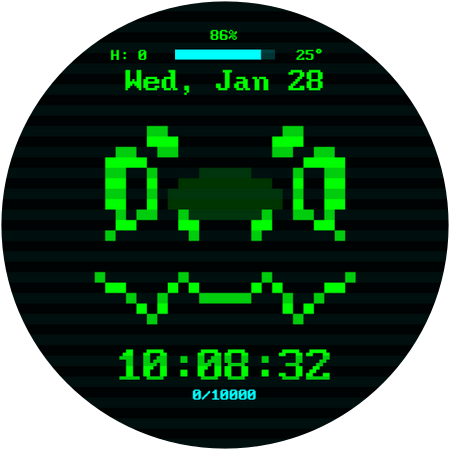
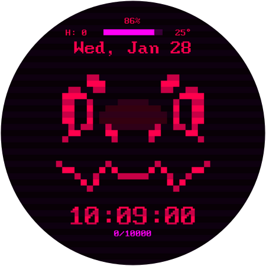
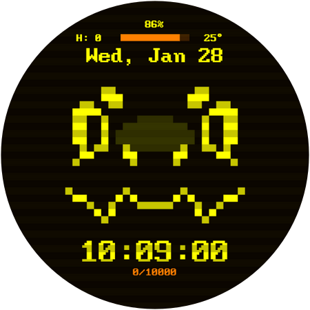
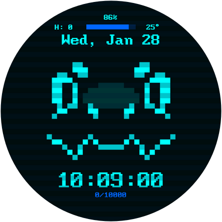
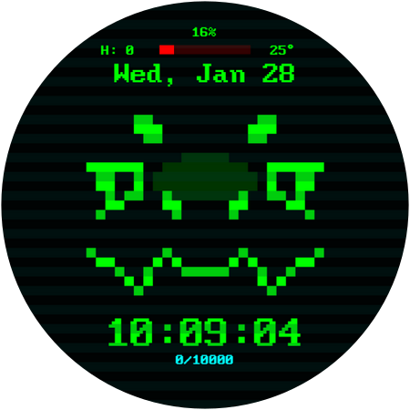
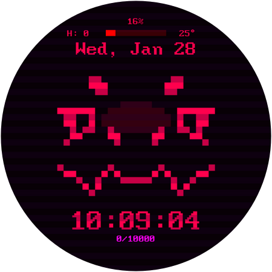
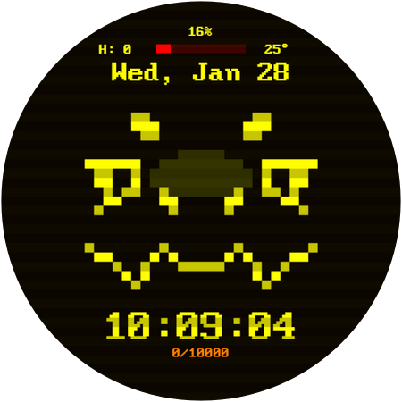
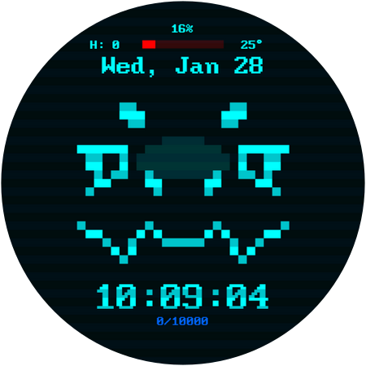

# ProtoWatchface
A fairly simple smart watch face.
Do note that I have only tested this watch face with SAMSUNG watches running OneUI (Android). I am unsure if it will work with other brands.

> I'll try to publish an editable version in the future. For now, this repository only holds the installer for the watch face.

---
# Features

### 4 Color choices

<table><tr><td></td><td></td><td></td><td></td></tr></table>

### Low battery expression

<table><tr><td></td><td></td><td></td><td></td></tr></table>

### Boopable!

## Additional Features
- Displays
  - Heart rate
  - Date
  - Step count/Step Goal
  - Temperature
  - Dynamic battery percentage
  - Notification alerts
- Customizable Dual Edge complications.
- Always On Display compatible.

---
# Installation
To install the APK into your watch, first. Download the APK realease from an Android device. Then, you'll need a sideloading app like [Bugjaeger](https://play.google.com/store/apps/details?id=eu.sisik.hackendebug) or [Wear Installer 2](https://play.google.com/store/apps/details?id=org.freepoc.wearinstaller2). You can find tutorials online on how to sideload apps into your watch, but this one by Malcolm Bryant (Developer of Wear Installer) has been the most helpful.

